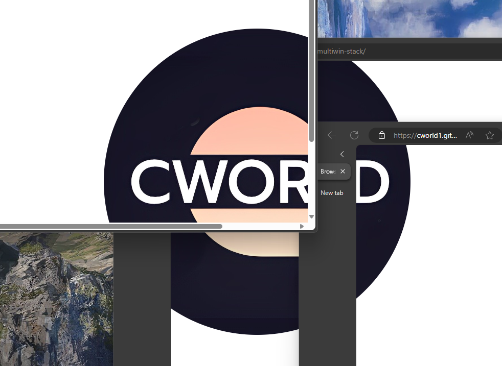

# Effect of Browser Multi-Window Stacking

[](https://github.com/cworld1/browser-multiwin-stack/commits)
[](https://github.com/cworld1/browser-multiwin-stack/stargazers)
[](https://github.com/cworld1/browser-multiwin-stack/blob/main/LICENSE)

浏览器多窗口堆叠特效

A demo program that shows effect of browser multi-window stacking, using new broswer experimental window api called `window.getScreenDetails`.

## Online demo

[Demo (Github)](https://cworld1.github.io/browser-multiwin-stack/)

## Screenshot



## Known issue

- For Firefox, it cannot work still. See [#1](https://github.com/cworld1/browser-multiwin-stack/issues/1).

## Local development

Environment requirements:

- [Python](https://www.python.org/): 3.8+

Clone the repository:

```shell
git clone https://github.com/cworld1/browser-multiwin-stack.git
```

Run the server:

```shell
cd ./browser-multiwin-stack
python ./scripts/server.py
```

Visit and test api:

- Open `http://127.0.0.1:8000/`
- Click the image
- Give the basic permissions

You can open multi windows with the same link and splice it.

## Contributions

To spend more time coding and less time fiddling with whitespace, this project uses code conventions and styles to encourage consistency. Code with a consistent style is easier (and less error-prone!) to review, maintain, and understand.

<!-- ## Thanks -->

## License

This project is licensed under the GPL 3.0 License.
